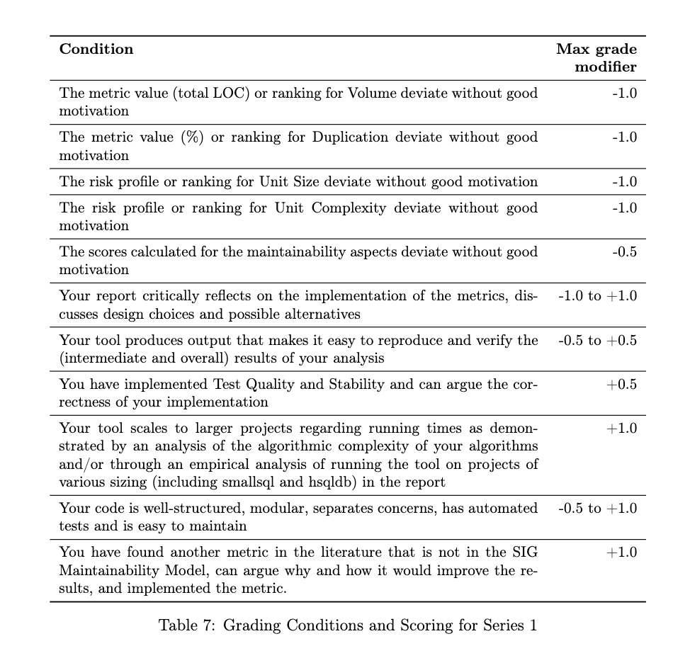

# Series 1

## Assignment
Using Rascal, design and build a tool that calculates the SIG Maintainability
Model scores for a Java project. Document your approach in a report that com-
plements the implementation, e.g., by describing relevant design decisions, tests,
results, and what you did to address threats to validity. Make sure that your re-
port (also) answers all the questions of the above introduction

Calculate at least the following metrics:
1. Volume
2. Unit Size
3. Unit Complexity
4. Duplication

For all metrics you calculate the actual metric values, for Unit Size and Unit
Complexity you additionally calculate a risk profile, and finally each metric gets a
score based on the SIG model (−−, −, o, +, ++)

Calculate scores for at least the following maintainability aspects based on the
SIG model

• Maintainability (overall),
• Analysability,
• Changeability,
• Testability.

## Bonus Points

You can earn bonus points by also implementing the Test Quality metric and
a score for the Stability maintainability aspect.

Your tool should print textual output that contains all of the above information
in a way that is efficient with space, easy to read and makes it easy to confirm the
calculations

## Grading Criteria

## Other points

Furthermore, your solution has a sensible design and code implementation.
In your report you explain and motivate how your solution reads the Java
code and calculates the metrics, the rankings, reflects on (additional) met-
rics and threats to validity. Your implementation should be runnable when
submitted. To demonstrate scalability empirically, also submit a script that
makes it possible to reproduce your experiment(s) without effort. Table 7
shows conditions and how they modify the grade (the teachers have a refer-
ence implementation that provides outputs for comparison).